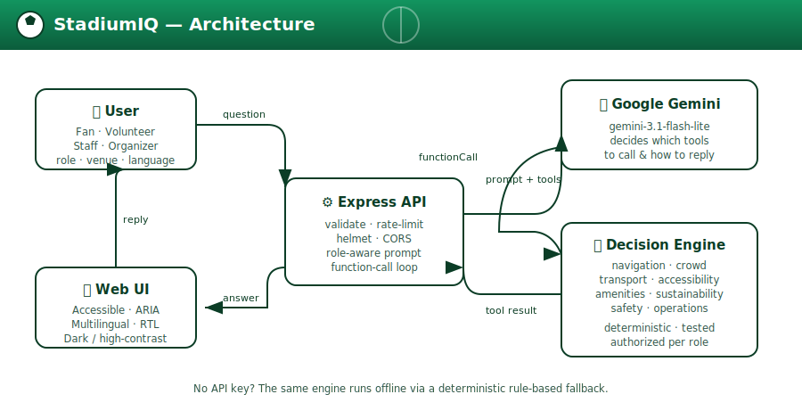

# ⚽ StadiumIQ — GenAI Smart Stadium & Tournament Operations Assistant

> A role-aware, multilingual **Generative-AI assistant** for the **FIFA World Cup 2026** that helps fans, volunteers, venue staff and organizers with navigation, crowd management, accessibility, transport, sustainability and real-time operational decisions — powered by **Google Gemini** function-calling.


### 🌐 Live demo: **https://stadiumiq-chi.vercel.app**

---

## 1. Challenge & chosen vertical

**Challenge 4 – Smart Stadiums & Tournament Operations.** Build a GenAI solution that improves the stadium and tournament experience across navigation, crowd management, accessibility, transportation, sustainability, multilingual assistance, operational intelligence and real-time decision support.

**Primary persona (my chosen vertical): the Fan — a match-day companion.** A first-time visitor arriving at an unfamiliar stadium in one of 16 cities across three countries, possibly speaking another language, possibly with accessibility needs, needing calm, correct answers *fast*.

**The insight that shapes the design:** the hardest problems for fans, volunteers, staff and organizers are the *same underlying questions* asked from different viewpoints (“where is X”, “how busy is Y”, “what should I do about Z”). So StadiumIQ uses **one GenAI brain that adapts to the user’s role** — the Fan is the flagship, and the very same engine serves volunteers, venue staff and organizers by changing its tone, priorities and, crucially, its **permissions**. That role-adaptation *is* the “logical decision making based on user context” the brief asks for, and it lets a single, clean solution cover **all eight verticals** instead of one.

---

## 2. Approach & logic

StadiumIQ is a **tool-using AI agent**, not a chatbot that guesses.

1. The user asks a question in natural language. The frontend sends it with **context**: role, venue, language, mobility needs.
2. Gemini receives a **role-specific system prompt** and a set of **function declarations** (the only tools that role is allowed to use).
3. Gemini decides *which* tool(s) to call and with *what* arguments — e.g. `plan_route_to_seat({ section: "114", mobilityNeeds: true })`.
4. The server executes those tools. **All real logic and data live in deterministic, unit-tested functions** — so gate numbers, transit lines and crowd advice are *computed*, never hallucinated.
5. Gemini turns the structured results into a short, friendly answer **in the user’s language**.

```
 User (role, venue, language, needs)
        │  "How do I get to section 114? I use a wheelchair"
        ▼
┌─────────────────────────────────────────────────────────┐
│  Express API  → validate → build role-aware system prompt │
└─────────────────────────────────────────────────────────┘
        │  contents + allowed tool declarations
        ▼
┌───────────────┐  functionCall: plan_route_to_seat(...)   ┌──────────────────────┐
│  Google Gemini │ ───────────────────────────────────────▶ │  Tool decision engine │
│ (Gemini Flash) │ ◀─────────────────────────────────────── │  (authorized, tested) │
└───────────────┘  functionResponse: { gate, steps, crowd } └──────────────────────┘
        │  final natural-language answer (localized)
        ▼
     Accessible chat UI
```

<p align="center"></p>

**No API key? It still works.** If `GEMINI_API_KEY` is absent (or a live call fails), StadiumIQ falls back to an **offline rule-based engine** that classifies intent and calls the *same* tools. The project is therefore always runnable and testable — Gemini upgrades the experience (free-form reasoning + full multilingual), it isn’t a hard dependency.

---

## 3. What it does — every vertical, mapped

| # | Vertical (from the brief) | Feature in StadiumIQ | Tool(s) |
|---|---|---|---|
| 1 | **Navigation** | Best gate + step-by-step route to any seat section | `get_venue_guide`, `plan_route_to_seat` |
| 2 | **Crowd management** | Live crowd density, queue estimates, quieter-gate advice | `get_crowd_status` |
| 3 | **Accessibility** | Step-free routing, wheelchair/sensory/hearing/vision services | `get_accessibility_services` (+ accessibility-first routing) |
| 4 | **Transportation** | Rail / shuttle / rideshare / parking comparison, arrive & depart | `plan_transport` |
| 5 | **Sustainability** | Recycling, reusable cups, water refill, low-emission travel nudges | `get_sustainability_tips` (+ transport nudge) |
| 6 | **Multilingual assistance** | Replies in English, Spanish, French, Portuguese, German, Arabic (RTL) | Gemini + language context |
| 7 | **Operational intelligence** | Report incidents (routed to the right team) + live ops brief | `report_incident`, `get_operations_brief` |
| 8 | **Real-time decision support** | Crowd- and time-aware recommendations; calm safety guidance | `get_crowd_status`, `get_safety_guidance` |

**16 host venues** across the USA, Canada and Mexico are included (MetLife, SoFi, Mercedes-Benz, AT&T, NRG, Arrowhead, Gillette, Hard Rock, Lincoln Financial, Levi’s, Lumen, plus BMO Field, BC Place, Estadio Azteca, Estadio Akron and Estadio BBVA).

### Role-based logic & permissions
| Role | Priorities | Extra powers |
|---|---|---|
| **Fan** | navigation, accessibility, transport, amenities | — |
| **Volunteer** | + crowd, safety | can `report_incident` |
| **Venue staff** | crowd, operations, safety | `report_incident`, `get_operations_brief` |
| **Organizer** | operations, sustainability | `report_incident`, `get_operations_brief` |

Authorization is enforced **server-side in the tool dispatcher** — even a prompt-injected message can’t make a Fan log incidents.

### Not just a chatbot — a full match-day web app

The GenAI assistant is one of **five views** in a framework-free single-page app:

| View | What it gives you |
|---|---|
| 🏠 **Home** | Finals-week hero with a **live countdown to the Final** (July 19, MetLife), tournament facts and the knockout schedule strip |
| 🧠 **AI Assistant** | The Gemini-powered chat — replies rendered as rich text via a sanitising markdown renderer |
| 🗺️ **Stadium Map** | All 16 stadiums plotted from their real coordinates on an interactive SVG map — keyboard-accessible pins, country-coded, tap through to the guide or the assistant |
| 🏟️ **Venue Explorer** | Per-stadium cards → gates, transit, accessibility services, sustainability, dietary options and that stadium’s fixtures |
| 📡 **Ops Room** | Real-time decision support: per-gate load meters driven by the crowd model, a kickoff-time simulator and live incident intelligence |

Plus **stadium atmosphere**: a referee whistle and crowd swell **synthesised with the Web Audio API** (zero audio files shipped) — off by default, one-tap toggle, automatically disabled for users who prefer reduced motion.

---

## 4. Tech stack

- **Runtime:** Node.js (ESM), Express 4
- **GenAI:** Google Gemini via the official [`@google/genai`](https://www.npmjs.com/package/@google/genai) SDK, with **function calling**
- **Cloud:** Google Cloud Run, Cloud Firestore, Firebase Hosting (see §4a)
- **Frontend:** dependency-free vanilla HTML/CSS/JS (keeps the repo tiny and the UI fast)
- **Security:** helmet, CORS allow-list, express-rate-limit, strict input validation
- **Testing:** Node’s built-in `node:test` (zero test dependencies)

---

## 4a. Google Cloud & Firebase

StadiumIQ is built Google-first on the **no-cost tiers** (Gemini free tier + Firebase Spark), and every integration **degrades gracefully** so the app still runs with zero cloud setup.

| Service | How StadiumIQ uses it | Cost |
|---|---|---|
| **Gemini API** (Google AI) | The GenAI brain — function-calling decides which tools to run and writes the reply | Free tier |
| **Cloud Firestore** (Firebase Spark) | Persists logged incidents (operational intelligence) so the ops picture survives restarts and is shared across instances | Free (Spark) |
| **Firestore Security Rules** | `firestore.rules` denies all direct client access — writes happen only through the trusted backend | Free |
| **Vercel** | Free hosting: `/public` on the CDN, the Express API as a serverless function (`api/index.js` + `vercel.json`) | Free (Hobby) |
| **Cloud Run** *(optional)* | Same app as a container (`Dockerfile` included) for teams with GCP billing | Free tier* |

**Notable engineering detail:** the Firestore integration is a **zero-dependency REST client** (`src/services/firestore.js`) using only Node’s built-in `crypto` (to sign the service-account JWT) and `fetch`. That means Firestore support adds **no npm dependencies and no vulnerabilities**. Credentials resolve in order: `GOOGLE_SERVICE_ACCOUNT_JSON` env (Vercel), `GOOGLE_APPLICATION_CREDENTIALS` file (local), GCP metadata server (Cloud Run). Live service status is exposed at `GET /api/health`.

**Deploying free on Vercel (one codebase, no changes):**
```bash
npm i -g vercel && vercel login
vercel                                        # first deploy (accept defaults)
vercel env add GEMINI_API_KEY production      # paste your key
vercel env add GEMINI_MODEL production        # gemini-3.1-flash-lite
vercel env add FIREBASE_PROJECT_ID production           # optional, enables Firestore
vercel env add GOOGLE_SERVICE_ACCOUNT_JSON production   # optional, paste key JSON
vercel --prod
```

*Cloud Run alternative (needs billing):* `gcloud run deploy stadiumiq --source . --region us-central1 --allow-unauthenticated`

---

## 5. Project structure

```
stadiumiq/
├── public/                 # Accessible, multilingual vanilla frontend (5 views, no framework)
│   ├── index.html          #   Semantic markup, ARIA, skip-link, hash-routed views
│   ├── styles.css          #   Light/dark, high-contrast, larger-text, RTL, reduced-motion
│   ├── app.js              #   Entry: router, header context, a11y & sound toggles
│   └── js/
│       ├── state.js        #   Shared state + tiny pub/sub
│       ├── api.js          #   Fetch helpers
│       ├── markdown.js     #   Safe markdown renderer (escapes all input first)
│       ├── sound.js        #   Web-Audio-synthesised whistle/crowd (no audio files)
│       └── views/          #   chat.js, home.js, map.js, venues.js, ops.js
├── src/
│   ├── server.js           # Executable entry point (npm start) + Firebase init
│   ├── app.js              # Express app factory + security middleware
│   ├── config.js           # Single validated config from env
│   ├── data/
│   │   ├── venues.js       # 16 venues + DRY shared operations profile
│   │   └── matches.js      # Tournament calendar (knockout anchors)
│   ├── domain/
│   │   ├── roles.js        # Personas + per-role tool authorization
│   │   └── languages.js    # Supported languages (with RTL flag)
│   ├── middleware/         # errorHandler, validateChat
│   ├── routes/             # chat.js, meta.js, venues.js (/schedule, /venues/:id, /ops)
│   ├── services/
│   │   ├── assistant.js    # Orchestrator: Gemini function-call loop + fallback
│   │   ├── geminiClient.js # Thin, mockable SDK wrapper
│   │   ├── offlineEngine.js# Deterministic no-key reasoning
│   │   ├── prompt.js       # Context-aware system prompt + guardrails
│   │   ├── venueService.js # Merges venue overrides onto the base profile
│   │   ├── crowdModel.js   # Pure crowd-density model
│   │   ├── incidentStore.js# Incident log (in-memory + optional Firestore sink)
│   │   ├── firestore.js    # Zero-dependency Cloud Firestore REST client
│   │   └── tools/          # The decision engine (9 modules + registry, 11 tools)
│   └── utils/              # logger.js, validation.js
├── test/                   # 55 tests: tools, crowd, validation, offline, assistant, API, markdown
├── api/index.js            # Vercel serverless entry (exports the Express app)
├── vercel.json             # Vercel routing + security headers
├── docs/architecture.svg   # Architecture diagram
├── Dockerfile              # Optional Google Cloud Run image
├── firebase.json           # Firebase Hosting + Cloud Run rewrite
├── firestore.rules         # Secure-by-default Firestore rules
├── .env.example            # Copy to .env
├── .gitignore              # Ignores node_modules, .env & service accounts
├── LICENSE                 # MIT
└── README.md
```

---

## 6. Getting started

### Prerequisites
- Node.js **≥ 18.17** (works on Node 24)
- *(Optional)* a free Gemini API key from [Google AI Studio](https://aistudio.google.com/apikey)

### Install & run
```bash
git clone https://github.com/<your-username>/stadiumiq.git
cd stadiumiq
npm install

cp .env.example .env        # then paste your GEMINI_API_KEY (optional)

npm start                   # http://localhost:3000
```
Open **http://localhost:3000**, choose a role and venue, and start asking. With no key you’re in **offline mode**; add a key for full Gemini reasoning and multilingual replies.

### Configuration (`.env`)
| Variable | Default | Purpose |
|---|---|---|
| `GEMINI_API_KEY` | *(empty)* | Enables Gemini. Empty → offline mode. |
| `GEMINI_MODEL` | `gemini-3.1-flash-lite` | Free-tier model. Swap for `gemini-3-flash` etc. |
| `PORT` | `3000` | HTTP port |
| `NODE_ENV` | `development` | `production` hides error detail |
| `CORS_ORIGIN` | `*` | Comma-separated allow-list |
| `RATE_LIMIT_WINDOW_MINUTES` / `RATE_LIMIT_MAX_REQUESTS` | `15` / `60` | API rate limiting |
| `FIREBASE_PROJECT_ID` | *(empty)* | Enables Cloud Firestore persistence. Empty → in-memory. |
| `GOOGLE_APPLICATION_CREDENTIALS` | *(empty)* | Local only: path to a service-account JSON (not needed on Cloud Run) |

---

## 7. API

| Method & path | Description |
|---|---|
| `GET /api/health` | Liveness + active services (`genAI`, `persistence`) |
| `GET /api/meta` | Venues (with coordinates), roles, languages and live service status |
| `POST /api/chat` | Body `{ messages: [{role, content}], context: { role, venueId, language, mobilityNeeds } }` → `{ reply, toolsUsed, mode }` |
| `GET /api/schedule` | Tournament calendar (optionally `?venue=`) — powers Home & Venue views |
| `GET /api/venues/:id` | Full merged venue profile + its fixtures — powers the Venue Explorer |
| `GET /api/venues/:id/ops` | Gate-by-gate crowd loads + incident summary (`?minutesToKickoff=`) — powers the Ops Room |

---

## 8. Testing

```bash
npm test
```
55 tests, no external dependencies, covering:
- **Decision engine** — routing, accessibility-first logic, dietary options, transport nudges, match schedule, graceful errors.
- **Authorization** — fans cannot call staff-only tools; staff can and incidents are routed.
- **Crowd model** — arrival/egress curve, express-gate relief, bounds.
- **Validation** — shape/limit enforcement, defaults, clamping.
- **Offline engine** — intent classification.
- **Markdown renderer** — formatting *and* proof that script/HTML injection is neutralised (XSS).
- **Incident store & Firestore** — id sequencing, routing, severity aggregation, the fire-and-forget persistence sink, and the Firestore REST field serializer.
- **Assistant** — the full Gemini function-call loop driven by a **mocked** client, plus the offline fallback path.
- **API** — health, meta, chat, schedule, venue profiles and ops snapshots over real HTTP (in-process, offline).

---

## 9. Evaluation-criteria checklist

- **Problem-statement alignment** — one persona-led design covering *all eight* verticals across all 16 venues; features mapped in §3.
- **Code quality** — small single-responsibility ESM modules, JSDoc, injectable dependencies, DRY data, consistent style.
- **Security** — see §10.
- **Efficiency** — lean dependency set, in-memory data (no DB), capped tool-loop & trimmed history, stateless server, offline mode avoids needless API calls.
- **Testing** — see §8.
- **Accessibility** — see §11.

## 10. Security measures
- Secrets only via `.env` (gitignored); `.env.example` documents them.
- `helmet` security headers + strict **Content-Security-Policy**.
- **Server-side role authorization** on every tool call (never trusted to the model).
- Strict input validation & length caps; 128 kB body limit; API rate limiting; CORS allow-list.
- **Prompt-injection guardrails** in the system prompt; permissions fixed by the system, not the conversation.
- Errors are logged server-side and **never leak stack traces** to clients in production.
- Frontend renders replies with `textContent` only (no `innerHTML`) — no XSS.
- **Firestore security rules deny all direct client access**; writes go only through the trusted backend.
- Firestore is integrated via a **zero-dependency REST client**, so cloud persistence adds no third-party code.
- `npm audit`: **0 vulnerabilities**.

## 11. Accessibility features
- Semantic HTML, a **skip link**, labelled controls, and an `aria-live` conversation log that announces replies to screen readers.
- Full **keyboard** operation; visible `:focus-visible` outlines; focus returns to the input after each reply.
- **High-contrast** and **larger-text** toggles (persisted), plus automatic light/dark and **reduced-motion** support.
- **RTL** layout for Arabic and multilingual replies.
- Accessibility is also a *product feature*: “Step-free routes” context makes every answer prioritise accessible options.

---

## 12. Assumptions
- **Stadium *metadata* is real** (names, cities, capacities, coordinates). Fine-grained **operational data** (gate compass positions, shuttle names, live crowd numbers, incidents) is **realistic but illustrative** — a production build would stream these from each venue’s operations, transit and CCTV/turnstile APIs. This is isolated in `src/data/` and the tool layer so real feeds can be dropped in without touching the AI logic.
- Crowd density is modelled from the well-known match-day arrival/egress curve rather than live sensors.
- Incidents persist to **Cloud Firestore** when configured, and fall back to an in-memory store otherwise so the app always runs with zero setup.
- In **offline mode** replies are English-only; full multilingual needs a Gemini key.
- Google Cloud services are **optional by design**: the app is fully functional with no key, so evaluators can always run it, while a configured deployment showcases the full cloud stack.

## 13. Roadmap
- Live data feeds (transit GTFS-RT, turnstile counts, incident systems).
- Firebase Authentication to bind the staff/organizer roles to real sign-in.
- Streaming responses and voice input for hands-free, eyes-free help.

## License
[MIT](LICENSE)
